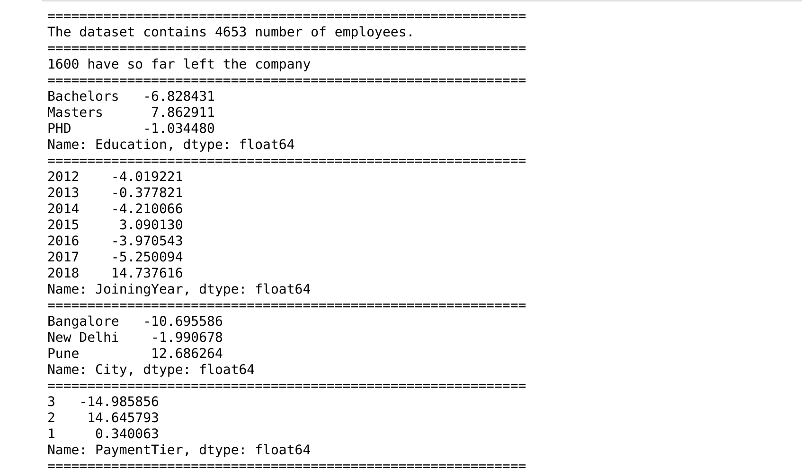
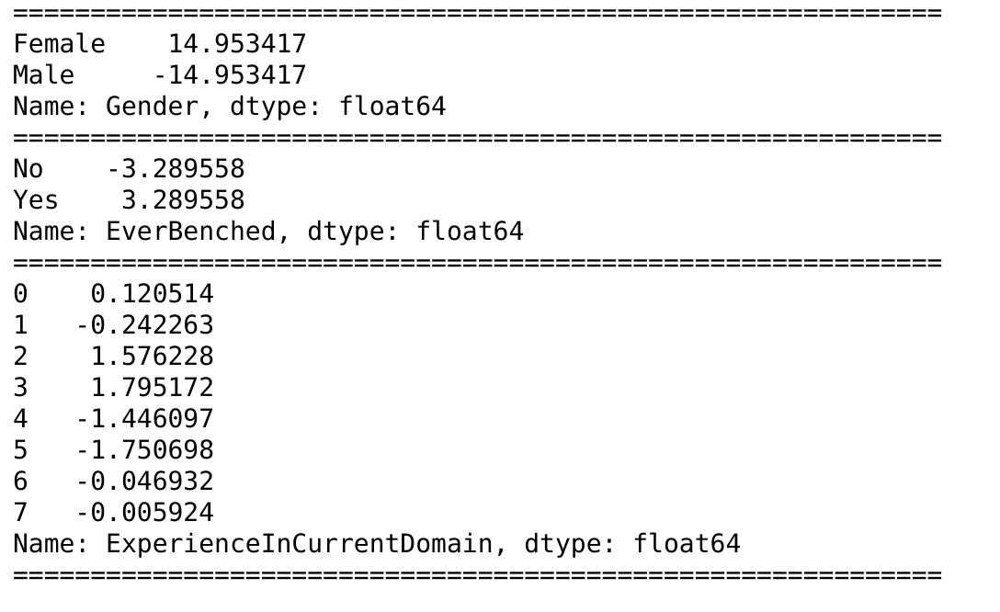
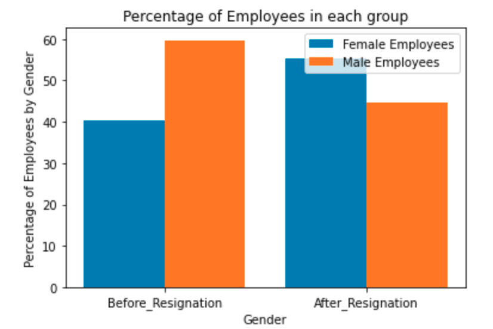

# Predicting Employee Resignation

A company's HR department wants to predict whether some customers better called employees would leave their employments in the next 2 years. The goal is to build a predictive model that predicts the prospects of future and present employees resigning their jobs or not. The dataset is from [kaggle.com](https://www.kaggle.com/tejashvi14/employee-future-prediction?select=Employee.csv).

## Project Overviews cum Important Questions
The project will answer and address the following issues:

1. How many employees in the company and how many have left the company so far?
2. Which group of employees have the tendency to leave most?
3. Build a predictive model that predicts the prospects of the present and future employees leaving the company.

## Project Approach Using CRISP-DM
The project adopts Cross-Industry Standard Process for Data Management (CRISP-DM).
The following tasks are performed in the project using CRISP-DM:

    1. Business Understanding
    2. Data Understanding
    3. Data Preparation
    4. Modeling
    5. Evaluation
    6. Deployment

### Business Understanding
This is modularized in a function called `business_understanding(df)`. The output is as follows:
The HR has identified and curated data from employees using nine criteria, namely:

1. Education
2. The year of joining the company (JoiningYear)
3. City of the employees
4. Payment Tier
5. Age of employees.
6. Gender of employees
7. Whether or not an employee was ever benched (EverBenched)
8. Experience in current domain
9. Whether the employee leaves the company or not (LeaveOrNot) - the goal of this project

### Data Understanding 
Data understanding is modularized in a function known as `data_cleaning_and_understanding(dataframe)`. Below is an image of the result:

The diagram below shows the comparison between the distributions of employees before and after those that left their employments with respect to gender. 

### Data Preparation
The data needed for the modeling is prepared under a function called `create_dummy_df(df, dummy_na=False)`. 

### Modeling

The model for the prediction is also contained in a function called `pipeline(df)`. XGBoost Classifier is used in conjuction with Baysian Optimization for tuning the parameters and training the model.

The model is then exported by saving it in a file using pickle or mlflow. 

### Evaluation
The model is evaluated using `sklearn predict()` method while the performance metrics are realized using `classification_report, cross_val_score and  accuracy_score `. The accuarcy of the model stands at approximately 87 percent. 

### Deployment 
The model is deployed as a web app using `Plotly Dash`. 

### Status of the Project

The project is `ongoing`. 

### Authors
Ernest Offor Ugwoke
